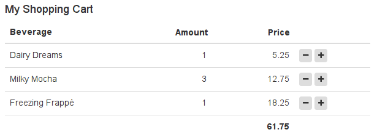

[« return to the manuals](index.md)

Preliminary readings:

* [LaxarJS Core Concepts](../concepts.md)
* [Widgets and Activities](./widgets_and_activities.md)


# Controls and Libraries

In LaxarJS, any non-trivial HTML element, [HTML5 Web Component](http://webcomponents.org/) or [AngularJS directive](https://docs.angularjs.org/guide/directive) is considered a _control_.
While widgets and activities deal with business logic, controls handle the technical details of user interaction.
To provide their business logic, widgets and activities often depend on libraries, which might be created by third parties or simply be used to share common functionality.
In the latter case, be sure not to couple your controllers to tightly, e.g. the shared libraries should not allow to share state.

Here are some examples of controls:

  * a select box
  * a date picker
  * an accordion control
  * a tab control

LaxarJS helps when developing a custom control by managing its AngularJS modules, as well as its CSS and HTML assets for you.
If (and only if) you _use_ a control in one or more widgets, LaxarJS will load its CSS according to the current [theme](./creating_themes.md), just like with widgets and templates.
When you remove the control from your widget, or the widget from your page, its code and asset will no longer increase your application footprint. 
This allows you to create and distribute large libraries of controls without fear of application bloat.


## Creating or Integrating a Control

While HTML5 Web Components are very interesting, the current browser support is limited.
For this reason, LaxarJS currently only covers the creation of a control as an AngularJS directive.

Of course you can still use Web Components, jQuery UI or any other way of creating controls in your widgets, but LaxarJS currently will not manage assets for them.
The recommended way is therefore to wrap such controls in an AngularJS directive.
This can be done either for a single widget by simply adding a directive to its module, or following the steps below. 


### Creating a Control using an AngularJS directive

LaxarJS does not care whether your control is installed through bower or if it is a part of your project, as long as it has a _RequireJS path_ configured.
Basic familiarity with [RequireJS](http://requirejs.org/) should be enough to create your own controls.
When writing a control to integrate third party libraries that do not support RequireJS, this can sometimes be tricky.  

Let us try to create a control that displays a digital clock to the user.

#### RequireJS Path

First, choose a location for your controls, such as `includes/lib/my_controls`.
In the require configuration, you need add the path to your new controls library:

```JS
paths: {
   // ...
   'my_controls': '../includes/lib/my_controls'
}
```

This assumes that `bower_components` is your RequireJS `baseUrl`.
If it is something else, you will need to change the path accordingly (such as `lib/my_controls` if using `includes/` as base URL).

Now the _require-path_ for the clock-control is _my_controls/clock_.

#### AngularJS directive

Now let us create the AngularJS module for the control, in `includes/lib/my_controls/clock.js`:

```JS
define( [ 'angular', 'text!my_controls/clock/clock.html' ], function( ng, clockTemplate ) {
   'use strict';

   var module = ng.module( 'my_controls.clock', [] );

   module.filter( 'myPad', function() {
      return function( number ) {
         return ( number < 10 ? '0' : '' ) + number;
      }
   } );

   return module.directive( 'myClock', [ '$timeout', function( $timeout ) {
      return {
         restrict: 'E',
         template: clockTemplate,
         link: function( $scope ) {
            tick();
            function tick() {
               $scope.date = new Date();
               $timeout( tick, 1000 );
            }
         }
      };

   } ] );

} );
```

For the directive, we use a prefix, to avoid collisions with future HTML elements and other controls.
Make sure to return the AngularJS module as shown here, so that LaxarJS can use it when bootstrapping your application.


#### AngularJS template

Let us create a simple template at `includes/lib/my_controls/clock/clock.html`.

```HTML
<span class="my-clock">
   {{ date.getHours() | myPad }}:{{ date.getMinutes() | myPad }}:{{ date.getSeconds() | myPad }}
</span>
```

Use a prefix for the custom CSS class, to avoid collision with other controls and libraries.
Of course, for maximum performance you might want to move the filtering to the _tick_ function, but this should be fine as an example.

#### The CSS stylesheet

To automatically load your CSS depending on the theme, it has to be placed into a sub-directory `default.theme/css` of your require path and it has to use the same file name as the controller file.
In case of the clock, the correct path is `includes/lib/my_controls/clock/default.theme/clock.css`.

```CSS
.my-clock {
   font-family: 'Times New Roman', serif;
   font-weight: bold;
   font-size: 36px;
   border: 3px double black;
   padding: 3px;
}
```


### Using a Control from a Widget

Any widget that uses our clock should declare its dependency using `controls` entry in its `widget.json`:

```JSON
"controls": [ "my_controls/clock" ],
```

This allows the portal to load the RequireJS module and to register its AngularJS module during bootstrap.
Additionally this causes the control CSS to be loaded from the correct theme, and to be bundled when creating a release-version of your application. 

To actually get the control onto the screen, you have to reference it from your widget template:

```HTML
<h3>My Widget, now with 100% more clock!</h3>
<my-clock></my-clock>

```

After adding your widget to a page, you may inspect your timepiece in the browser:




## Creating or Integrating a Library

TODO
